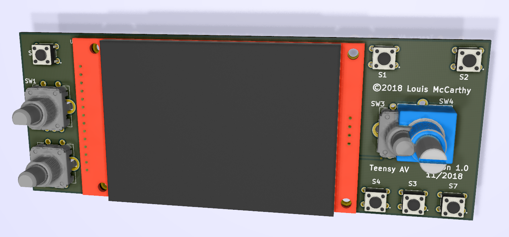
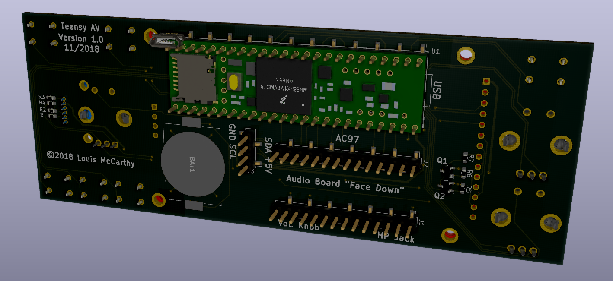

# TeensyAV
A two-layer printed circuit board that breaks out a Teensy 3.5 or 3.6. Its primary goal is to provide a front end for the [Teensy Convolution Sofware Defined Radio](https://github.com/compeoree/Teensy-ConvolutionSDR), but can be used for any audio/video project. 

# UNTESTED!
This is a work in progress and has yet to be fabricated, assembled, or tested.

# Easy Method
* Order PCB through [OSHPark](https://oshpark.com/shared_projects/IBIkLilf)

# DIY Method
* Install KiCad version 5 (http://kicad-pcb.org/download/)
* Copy Library and Modules to KiCad install directory (usually {install_location}/KiCad/share/kicad/)
* Open TeensyAV.pro project file

## BOM (Total price approximately $90)
* PCB ([$18.68](https://oshpark.com/shared_projects/IBIkLilf))
* U1 Teensy 3.6 ([$29.25](https://www.pjrc.com/store/teensy36.html))
* J1 Audio Board ([$14.25](https://www.pjrc.com/store/teensy3_audio.html))
* U2 Touchscreen ([$15.00](https://www.pjrc.com/store/display_ili9341_touch.html))
* Q1 Si2371EDS MOSFET ([$0.49](https://www.mouser.com/ProductDetail/78-SI2371EDS-T1-GE3))
* Q2 BSR802N MOSFET ([$0.46](https://www.mouser.com/ProductDetail/726-BSR802NL6327))
* S1,S2,S3,S4,S5,S7 Switches ([$0.25](https://www.mouser.com/ProductDetail/653-B3F-1000))
* SW1,SW2,SW3 Magnetic Encoder ([$1.14](https://www.mouser.com/ProductDetail/858-EN12-HS22AF20))
* SW4 Optional Optical Encoder ([$28.30](https://www.mouser.com/ProductDetail/652-EM14A0D-B28L064N))
* R1,R2,R3,R4 10K SMD Resistor ([$0.10](https://www.mouser.com/ProductDetail/603-RC0603FR-0710KL))
* CR2032 RTC Battery and Holder ([$0.29](https://www.mouser.com/ProductDetail/712-BAT-HLD-001))
* J1,J2 SMD male headers ([$2.10](https://www.mouser.com/ProductDetail/710-61001418221))
* U1 SMD male headers (left) ([$3.61](https://www.mouser.com/ProductDetail/710-61002418221))
